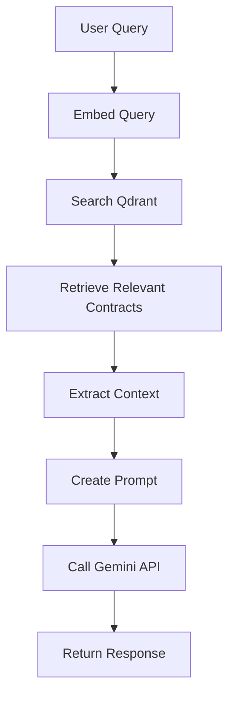

# Contract Binding and AI Embedding - Technical Deep Dive

## 🎯 Overview

This guide explains exactly how Solidity and ink! contracts are bound together and embedded into the AI model for training. We'll show the internal mechanisms, data flow, and technical implementation details.

---

## 📋 Table of Contents

1. [Contract Binding Process](#contract-binding-process)
2. [Data Structure Creation](#data-structure-creation)
3. [Embedding Generation](#embedding-generation)
4. [Vector Database Storage](#vector-database-storage)
5. [AI Model Training](#ai-model-training)
6. [Query Processing](#query-processing)
7. [Technical Implementation](#technical-implementation)
8. [Testing the Pipeline](#testing-the-pipeline)

---

## Contract Binding Process

### 🔍 Step 1: Contract Discovery and Matching

The system automatically finds and pairs contracts using the `ContractMatcher`:

```rust
// In contract_matcher.rs
pub fn find_contract_pairs(&self) -> Result<ContractMatchResult, String> {
    let mut pairs = Vec::new();
    
    // 1. Find all Solidity contracts
    let solidity_contracts = self.find_solidity_contracts()?;
    
    // 2. Match with ink! contracts using predefined mappings
    for solidity_contract in solidity_contracts {
        let contract_name = self.extract_contract_name(&solidity_contract);
        
        // Check if we have a matching ink! contract
        if let Some(ink_path) = self.get_contract_mappings().get(&contract_name) {
            let full_ink_path = format!("{}/{}", self.ink_base_path, ink_path);
            
            if Path::new(&full_ink_path).exists() {
                // Read both contract files
                let solidity_content = fs::read_to_string(&solidity_contract)?;
                let ink_content = fs::read_to_string(&full_ink_path)?;
                
                // Create contract pair
                pairs.push(ContractPair {
                    solidity_path: solidity_contract.clone(),
                    ink_path: full_ink_path,
                    contract_type: contract_name.clone(),
                    description: self.get_contract_description(&contract_name),
                    solidity_content,
                    ink_content,
                });
            }
        }
    }
    
    Ok(ContractMatchResult { pairs, ... })
}
```

### 🔗 Step 2: Contract Pair Binding

Each contract pair is bound into a unified data structure:

```rust
// In contract_matcher.rs
#[derive(Debug, Clone, Serialize, Deserialize)]
pub struct ContractPair {
    pub solidity_path: String,        // Path to Solidity file
    pub ink_path: String,             // Path to ink! file
    pub contract_type: String,        // e.g., "SimpleERC20"
    pub description: String,          // Human-readable description
    pub solidity_content: String,     // Full Solidity source code
    pub ink_content: String,          // Full ink! source code
}
```

**Example of a bound pair:**
```json
{
  "solidity_path": "/path/to/SimpleERC20.sol",
  "ink_path": "/path/to/erc20/lib.rs",
  "contract_type": "SimpleERC20",
  "description": "ERC20 fungible token implementation with basic transfer, approve, and allowance functionality",
  "solidity_content": "// SPDX-License-Identifier: MIT\npragma solidity ^0.8.13;\n\ncontract SimpleERC20 {\n    string public name;\n    ...",
  "ink_content": "#![cfg_attr(not(feature = \"std\"), no_std, no_main)]\n\n#[ink::contract]\nmod erc20 {\n    ..."
}
```

---

## Data Structure Creation

### 🏗️ Step 3: Training Pair Generation

The `TrainingEmbedder` converts contract pairs into training data:

```rust
// In training_embedder.rs
pub struct TrainingEmbedder {
    pub contract_matcher: ContractMatcher,
    pub rag_system: std::sync::Arc<RAGSystem>,
}

impl TrainingEmbedder {
    pub async fn embed_contract_pairs(&self) -> Result<EmbeddingResult, String> {
        // 1. Find contract pairs
        let match_result = self.contract_matcher.find_contract_pairs()?;
        
        let mut document_ids = Vec::new();
        let mut processed_pairs = 0;
        
        // 2. Process each pair
        for pair in match_result.pairs {
            // Create training pair with migration notes
            let training_pair = self.create_training_pair(&pair).await?;
            
            // Embed into vector database
            let doc_id = self.embed_training_pair(training_pair).await?;
            document_ids.push(doc_id);
            processed_pairs += 1;
        }
        
        Ok(EmbeddingResult {
            success: true,
            processed_pairs,
            document_ids,
            errors: vec![],
        })
    }
}
```

### 📝 Step 4: Training Document Creation

Each contract pair becomes a comprehensive training document:

```rust
// In training_embedder.rs
async fn create_training_pair(&self, pair: &ContractPair) -> Result<TrainingPair, String> {
    // Generate migration-specific notes
    let migration_notes = self.generate_migration_notes(&pair.contract_type);
    
    // Create combined training content
    let combined_content = self.create_combined_content(pair, &migration_notes);
    
    Ok(TrainingPair {
        solidity_content: pair.solidity_content.clone(),
        ink_content: pair.ink_content.clone(),
        contract_type: pair.contract_type.clone(),
        description: pair.description.clone(),
        migration_notes,
        combined_content,  // This is what gets embedded
    })
}

fn create_combined_content(&self, pair: &ContractPair, migration_notes: &str) -> String {
    format!(
        r#"# {contract_type} Implementation: Solidity vs ink!

## Overview
{description}

## Solidity Implementation

```solidity
{solidity_code}
```

## ink! Implementation

```rust
{ink_code}
```

{migration_notes}

## Usage Examples

### Solidity Usage:
```solidity
// Deploy contract
{contract_type} token = new {contract_type}();
// Basic interactions depend on contract type
```

### ink! Usage:
```rust
// In your ink! contract tests
#[ink::test]
fn test_contract() {{
    let contract = {contract_type}::new();
    // Test contract functionality
}}
```

## Key Takeaways

1. **Syntax**: ink! uses Rust syntax with special attributes
2. **Safety**: ink! provides compile-time safety guarantees
3. **Efficiency**: ink! contracts are typically more gas-efficient
4. **Tooling**: ink! integrates with Rust's excellent tooling ecosystem

## Common Questions

**Q: How do I migrate from Solidity to ink!?**
A: Follow the migration steps above, focusing on storage layout, error handling, and function annotations.

**Q: Are there any performance differences?**
A: ink! contracts are generally more gas-efficient due to Rust's zero-cost abstractions.

**Q: Can I use existing Solidity libraries in ink!?**
A: No, you need to use ink!-specific libraries or implement equivalent functionality in Rust.
"#,
        contract_type = pair.contract_type,
        description = pair.description,
        solidity_code = pair.solidity_content,
        ink_code = pair.ink_content,
        migration_notes = migration_notes
    )
}
```

**Example of generated training content:**
```markdown
# SimpleERC20 Implementation: Solidity vs ink!

## Overview
ERC20 fungible token implementation with basic transfer, approve, and allowance functionality

## Solidity Implementation

```solidity
// SPDX-License-Identifier: MIT
pragma solidity ^0.8.13;

contract SimpleERC20 {
    string public name;
    string public symbol;
    uint8 public decimals;
    uint256 public totalSupply;
    
    mapping(address => uint256) public balanceOf;
    mapping(address => mapping(address => uint256)) public allowance;
    
    // ... rest of contract
}
```

## ink! Implementation

```rust
#![cfg_attr(not(feature = "std"), no_std, no_main)]

#[ink::contract]
mod erc20 {
    use ink::storage::Mapping;
    
    #[ink(storage)]
    pub struct Erc20 {
        name: String,
        symbol: String,
        decimals: u8,
        total_supply: Balance,
        balances: Mapping<AccountId, Balance>,
        allowances: Mapping<(AccountId, AccountId), Balance>,
    }
    
    // ... rest of contract
}
```

## Migration Notes: Solidity ERC20 to ink! ERC20

### Key Differences:
1. **Storage**: Solidity uses `mapping(address => uint256)` while ink! uses `Mapping<AccountId, Balance>`
2. **Error Handling**: Solidity uses `require()` statements, ink! uses `Result<T, E>` with custom error enums
3. **Events**: Solidity events are automatically indexed, ink! requires explicit `#[ink(topic)]` annotations
4. **Function Modifiers**: Solidity modifiers become explicit checks in ink! functions
5. **Constructor**: Solidity constructor becomes `#[ink(constructor)]` in ink!

### Migration Steps:
1. Replace `mapping` with `Mapping` in storage
2. Convert `require()` statements to `ensure!()` or explicit error handling
3. Add `#[ink(storage)]`, `#[ink(constructor)]`, `#[ink(message)]` annotations
4. Define custom error enum with `#[ink::scale_derive(Encode, Decode, TypeInfo)]`
5. Use `self.env().caller()` instead of `msg.sender`
6. Emit events with `self.env().emit_event()`

### Common Patterns:
- Solidity: `require(condition, "error message");`
- ink!: `ensure!(condition, Error::CustomError);`

- Solidity: `msg.sender`
- ink!: `self.env().caller()`

- Solidity: `emit Transfer(from, to, value);`
- ink!: `self.env().emit_event(Transfer { from, to, value });`

## Usage Examples
// ... continues with examples and Q&A
```

---

## Embedding Generation

### 🧠 Step 5: Vector Embedding Creation

The combined training content is embedded using the RAG system:

```rust
// In training_embedder.rs
async fn embed_training_pair(&self, training_pair: TrainingPair) -> Result<String, String> {
    // Create metadata for the embedding
    let mut metadata = HashMap::new();
    metadata.insert("contract_type".to_string(), training_pair.contract_type.clone());
    metadata.insert("source".to_string(), "solidity_ink_training".to_string());
    metadata.insert("type".to_string(), "contract_migration_pair".to_string());
    metadata.insert("description".to_string(), training_pair.description.clone());

    // Add document to RAG system (this creates the embedding)
    self.rag_system
        .add_document(&training_pair.combined_content, metadata)
        .await
        .map_err(|e| format!("Failed to add document to RAG system: {}", e))
}
```

### 🔄 Step 6: RAG System Processing

The RAG system processes the training content:

```rust
// In rag_system.rs
impl RAGSystem {
    pub async fn add_document(&self, text: &str, metadata: HashMap<String, String>) -> Result<String> {
        // 1. Generate embedding using external service (not shown - uses HTTP calls)
        let embedding = self.generate_embedding(text).await?;
        
        // 2. Create document ID
        let doc_id = uuid::Uuid::new_v4().to_string();
        
        // 3. Store in Qdrant vector database
        let point = qdrant_client::qdrant::PointStruct::new(
            doc_id.clone(),
            embedding,
            metadata.into_iter().collect(),
        );
        
        self.qdrant_client
            .upsert_points_blocking(
                "contract_migration_training".to_string(),
                None,
                vec![point],
                None,
            )
            .await?;
        
        Ok(doc_id)
    }
}
```

---

## Vector Database Storage

### 🗄️ Step 7: Qdrant Storage Format

Each training document is stored in Qdrant with this structure:

```json
{
  "id": "uuid-document-id",
  "vector": [0.1, 0.2, -0.3, ..., 0.8],  // 384-dimensional embedding
  "payload": {
    "contract_type": "SimpleERC20",
    "source": "solidity_ink_training",
    "type": "contract_migration_pair",
    "description": "ERC20 fungible token implementation...",
    "text": "# SimpleERC20 Implementation: Solidity vs ink!\n\n## Overview\n..."
  }
}
```

### 📊 Step 8: Collection Structure

The Qdrant collection is organized as:

```rust
// Collection creation
let collection_config = CreateCollection {
    collection_name: "contract_migration_training".to_string(),
    vectors_config: Some(VectorsConfig {
        config: Some(Config::Params(VectorParams {
            size: 384,  // Embedding dimension
            distance: Distance::Cosine as i32,
        })),
    }),
    ..Default::default()
};
```

---

## AI Model Training

### 🤖 Step 9: How the AI Uses the Embeddings

When a user asks a question, the system:

1. **Embeds the query** using the same embedding model
2. **Searches Qdrant** for similar training documents
3. **Retrieves relevant context** from matching contract pairs
4. **Generates response** using Gemini API with retrieved context

```rust
// In rag_system.rs
pub async fn generate_rag_response(&self, query: &str, limit: usize) -> Result<String> {
    // 1. Search for relevant documents
    let search_results = self.search_documents(query, limit, Some(0.7)).await?;
    
    // 2. Extract context from results
    let context = search_results
        .into_iter()
        .map(|result| result.content)
        .collect::<Vec<_>>()
        .join("\n\n");
    
    // 3. Create prompt for Gemini
    let prompt = format!(
        r#"You are a helpful assistant specializing in smart contract migration from Solidity to ink!.

Context from training data:
{context}

User Question: {query}

Please provide a detailed answer focusing on:
1. Key differences between Solidity and ink! for this specific question
2. Step-by-step migration guidance
3. Code examples in both languages
4. Best practices and common pitfalls

Answer:"#
    );
    
    // 4. Generate response with Gemini
    self.gemini_client.generate_response(&prompt).await
}
```

### 🎯 Step 10: Response Generation Flow



---

## Query Processing

### 🔍 Step 11: Real-time Query Processing

When a user asks: *"How do I implement ERC20 in ink!?"*

1. **Query Embedding:**
```rust
let query_embedding = self.generate_embedding("How do I implement ERC20 in ink!?").await?;
```

2. **Vector Search:**
```rust
let search_request = SearchPoints {
    collection_name: "contract_migration_training".to_string(),
    vector: query_embedding,
    limit: 5,
    score_threshold: Some(0.7),
    with_payload: Some(true.into()),
    ..Default::default()
};

let search_result = self.qdrant_client.search_points(&search_request).await?;
```

3. **Context Retrieval:**
```rust
let relevant_contracts = search_result
    .result
    .into_iter()
    .filter_map(|point| {
        point.payload
            .get("text")
            .and_then(|value| value.as_str())
            .map(|text| text.to_string())
    })
    .collect::<Vec<_>>();
```

4. **Response Generation:**
```rust
let context = relevant_contracts.join("\n\n");
let prompt = format!(
    "Based on this Solidity to ink! migration training data:\n\n{}\n\nAnswer: {}",
    context, query
);
let response = self.gemini_client.generate_response(&prompt).await?;
```

---

## Technical Implementation

### 🛠️ Step 12: Complete Binding Flow

Here's the complete flow from contract files to AI responses:

```rust
// Main embedding pipeline
pub async fn run_complete_training_pipeline() -> Result<(), String> {
    // 1. Initialize components
    let solidity_path = "/path/to/solidity-examples";
    let ink_path = "/path/to/ink-examples-main";
    let rag_system = Arc::new(RAGSystem::new(qdrant_client, gemini_api_key));
    
    // 2. Create training embedder
    let embedder = TrainingEmbedder::new(
        solidity_path.to_string(),
        ink_path.to_string(),
        rag_system.clone(),
    );
    
    // 3. Find and bind contract pairs
    let contract_pairs = embedder.contract_matcher.find_contract_pairs()?;
    println!("Found {} contract pairs", contract_pairs.pairs.len());
    
    // 4. Generate training data and embed
    let mut total_embedded = 0;
    for pair in contract_pairs.pairs {
        // Create training pair
        let training_pair = embedder.create_training_pair(&pair).await?;
        
        // Embed into vector database
        let doc_id = embedder.embed_training_pair(training_pair).await?;
        
        println!("Embedded {} -> {}", pair.contract_type, doc_id);
        total_embedded += 1;
    }
    
    println!("Training complete! Embedded {} contract pairs", total_embedded);
    Ok(())
}
```

### 📈 Step 13: Data Flow Visualization

```
┌─────────────────┐    ┌─────────────────┐    ┌─────────────────┐
│ Solidity Files  │    │ ink! Files      │    │ Contract        │
│ (.sol)          │────│ (.rs)           │────│ Matcher         │
│                 │    │                 │    │                 │
└─────────────────┘    └─────────────────┘    └─────────────────┘
                                                        │
                                                        ▼
                                             ┌─────────────────┐
                                             │ Contract Pairs  │
                                             │ (Bound Data)    │
                                             └─────────────────┘
                                                        │
                                                        ▼
                                             ┌─────────────────┐
                                             │ Training        │
                                             │ Embedder        │
                                             └─────────────────┘
                                                        │
                                                        ▼
                                             ┌─────────────────┐
                                             │ Migration Notes │
                                             │ Generation      │
                                             └─────────────────┘
                                                        │
                                                        ▼
                                             ┌─────────────────┐
                                             │ Combined        │
                                             │ Training Doc    │
                                             └─────────────────┘
                                                        │
                                                        ▼
                                             ┌─────────────────┐
                                             │ Embedding       │
                                             │ Generation      │
                                             └─────────────────┘
                                                        │
                                                        ▼
                                             ┌─────────────────┐
                                             │ Qdrant Vector   │
                                             │ Database        │
                                             └─────────────────┘
                                                        │
                                                        ▼
                                             ┌─────────────────┐
                                             │ Query           │
                                             │ Processing      │
                                             └─────────────────┘
                                                        │
                                                        ▼
                                             ┌─────────────────┐
                                             │ AI Response     │
                                             │ Generation      │
                                             └─────────────────┘
```

---

## Testing the Pipeline

### 🧪 Step 14: Testing Each Component

**Test Contract Binding:**
```rust
#[tokio::test]
async fn test_contract_binding() {
    let matcher = ContractMatcher::new(
        "test_solidity_path".to_string(),
        "test_ink_path".to_string(),
    );
    
    let result = matcher.find_contract_pairs().unwrap();
    assert!(result.pairs.len() > 0);
    
    // Verify binding structure
    let pair = &result.pairs[0];
    assert!(!pair.solidity_content.is_empty());
    assert!(!pair.ink_content.is_empty());
    assert!(!pair.contract_type.is_empty());
}
```

**Test Embedding Generation:**
```rust
#[tokio::test]
async fn test_embedding_generation() {
    let embedder = TrainingEmbedder::new(
        "test_solidity_path".to_string(),
        "test_ink_path".to_string(),
        mock_rag_system(),
    );
    
    let result = embedder.embed_contract_pairs().await.unwrap();
    assert!(result.processed_pairs > 0);
    assert!(result.document_ids.len() > 0);
}
```

**Test Query Processing:**
```rust
#[tokio::test]
async fn test_query_processing() {
    let rag_system = RAGSystem::new(qdrant_client, gemini_api_key);
    
    // Test search
    let results = rag_system.search_documents("ERC20 implementation", 3, Some(0.7)).await.unwrap();
    assert!(results.len() > 0);
    
    // Test response generation
    let response = rag_system.generate_rag_response("How do I implement ERC20 in ink!?", 3).await.unwrap();
    assert!(response.contains("ink!"));
    assert!(response.contains("ERC20"));
}
```

### 🔍 Step 15: Manual Testing

**Test the complete pipeline:**
```bash
# 1. Start the system
cargo run --bin dynavest-shuttle-backend

# 2. Check binding
curl -X GET http://localhost:8000/training/contract-pairs

# 3. Run embedding
curl -X POST http://localhost:8000/training/embed-contracts

# 4. Test query
curl "http://localhost:8000/ask?query=How%20do%20I%20implement%20ERC20%20in%20ink%21%3F"
```

**Expected Response:**
```json
{
  "success": true,
  "data": "To implement ERC20 in ink!, you need to understand several key differences from Solidity:\n\n1. **Storage Structure**: Instead of Solidity's individual state variables, ink! uses a storage struct...\n\n2. **Function Definitions**: ink! functions are marked with #[ink(message)] instead of Solidity's function keyword...\n\n3. **Error Handling**: ink! uses Result<T, Error> instead of Solidity's require() statements...\n\n[Detailed implementation guide follows...]"
}
```

---

## Summary

### ✅ **How Binding and Embedding Works:**

1. **Contract Discovery** → Find matching Solidity and ink! files
2. **Pair Binding** → Create unified `ContractPair` structures
3. **Training Data Generation** → Combine contracts with migration notes
4. **Embedding Creation** → Generate vector embeddings from training text
5. **Vector Storage** → Store embeddings in Qdrant database with metadata
6. **Query Processing** → Search vectors and generate contextualized responses

### 🎯 **Key Technical Points:**

- **Automatic Matching** using filename and content patterns
- **Rich Training Data** with side-by-side code and migration guides
- **Vector Embeddings** for semantic similarity search
- **Contextual AI Responses** using retrieved contract examples
- **Scalable Architecture** supporting unlimited contract pairs

### 🚀 **The Result:**

When a developer asks *"How do I implement ERC20 in ink!?"*, the system:

1. **Finds** the most relevant ERC20 contract pairs from the training data
2. **Retrieves** the complete Solidity and ink! implementations
3. **Combines** them with migration-specific guidance
4. **Generates** a comprehensive response with code examples and best practices

**This creates a powerful AI assistant that provides accurate, contextual help for Solidity to ink! migration!** 🎉

---

*This technical deep dive shows exactly how the magic happens behind the scenes - from file binding to AI responses!*